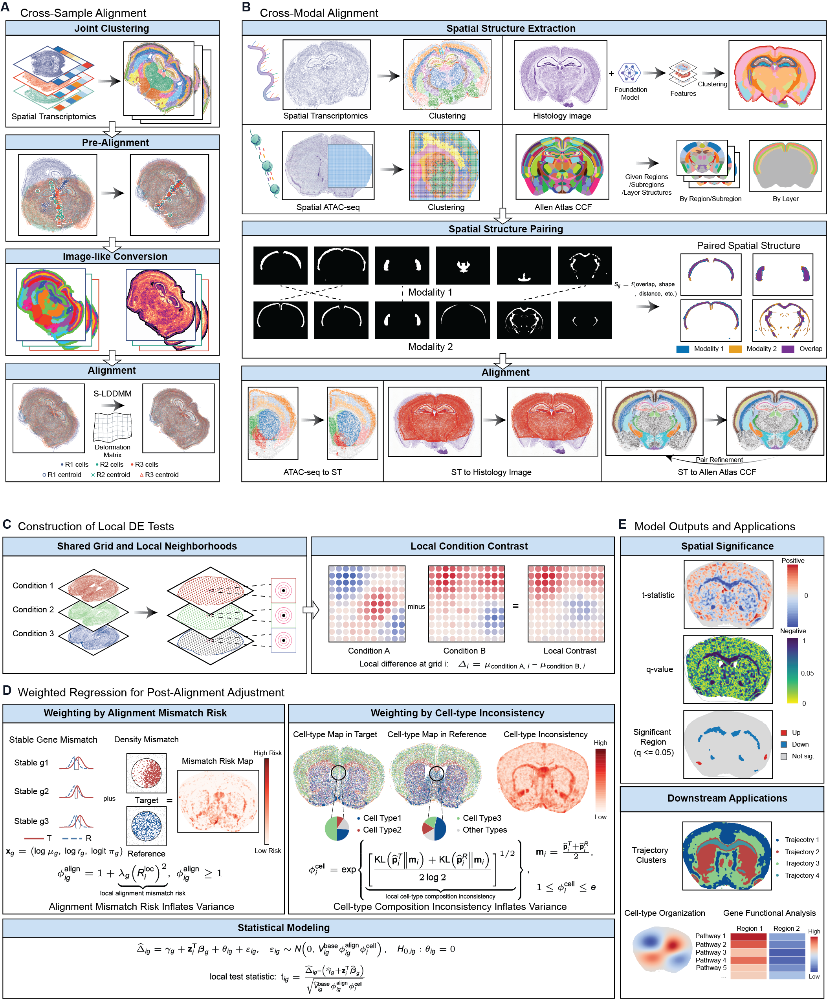

# spAlignDE

[](LICENSE)

<p align="center">
  
</p>

spAlignDE is a structure-guided framework for spatial alignment and
mismatch-aware local inference. The public package accepts AnnData/H5AD and
standardized CSV inputs and covers:

- cross-sample spatial-transcriptomics alignment;
- ST-to-Allen-CCF alignment and label transfer;
- ST-to-histology-image alignment through HIPT image features;
- spatial-ATAC-to-ST alignment;
- interactive many-to-many region pairing and refinement; and
- post-alignment local differential-expression inference.

- **Documentation:** https://dsong-lab.github.io/spAlignDE/
- **Tutorials:** https://dsong-lab.github.io/spAlignDE/tutorial.html
- **Executable notebooks:** https://dsong-lab.github.io/spAlignDE/source_notebooks.html

The public import is case preserving:

```python
import spAlignDE
print(spAlignDE.__version__)
```

## Install the validated notebook environment

The reference environment contains the complete package, notebook, UI and
documentation dependency set. Run from the cloned repository root:

```bash
unset PYTHONPATH
export PYTHONNOUSERSITE=1
conda env create -f environment.yml
conda activate spAlignDE-notebooks
python -m pip install --no-deps --no-build-isolation -e .
python -m ipykernel install --user \
  --name spAlignDE-notebooks \
  --display-name "Python (spAlignDE-notebooks)"
python tools/check_notebook_environment.py
```

On a GPU workstation, require the CUDA compatibility check:

```bash
python tools/check_notebook_environment.py --require-cuda
```

See [ENVIRONMENT.md](ENVIRONMENT.md) for the validated CUDA/CPU variants,
external HIPT and Allen CCF assets, reproducibility expectations and update
policy.

The public workflows fix every stochastic stage explicitly. Use seed `1234`
for single-sample BANKSY, seed `1000` for joint cross-sample clustering, seed
`0` for histology feature processing/clustering, and seed `1` for the
post-alignment reference subsampling. `spAlignDE.set_random_seed()` resets
Python, NumPy and Torch before randomized PCA; see the
[reproducibility tutorial](docs/source/tutorials/reproducibility.rst) for
launch-time controls and the exact-versus-tolerance validation contract.
Before publishing notebook changes, run
`python tools/audit_tutorial_reproducibility.py`; it checks all computational
notebooks, external-runner seed forwarding, pinned clustering backends,
reproducibility metadata and byte-identical Sphinx mirrors.

For a smaller package-only development installation:

```bash
python -m pip install -e ".[clustering,atlas,histology,ui,tutorial]"
```

## Public notebooks

Run notebooks in workflow order. The canonical, executed copies are under
[`source_notebooks/`](source_notebooks/); the documentation contains the same
saved outputs. The public notebook collection contains only the full data
analysis workflows listed below.

| Workflow | Notebook order |
|---|---|
| MERFISH mouse-brain cross-sample | `source_notebooks/clustering/clustering_joint_nb.ipynb` → `source_notebooks/cross_sample_alignment_nb.ipynb` |
| Mouse-kidney cross-sample | `source_notebooks/cross_sample_alignment_mouse_kidney_clustering_nb.ipynb` → `source_notebooks/cross_sample_alignment_mouse_kidney_alignment_nb.ipynb` |
| Breast-cancer cross-sample | `source_notebooks/cross_sample_alignment_breast_cancer_clustering_nb.ipynb` → `source_notebooks/cross_sample_alignment_breast_cancer_alignment_nb.ipynb` |
| Transformation uncertainty | `source_notebooks/cross_sample_uncertainty_report.ipynb` after the MERFISH workflow |
| ST to Allen CCF | `source_notebooks/clustering/clustering_single_nb.ipynb` → `source_notebooks/cross_modal_atlas_alignment_nb.ipynb` |
| UI-curated ST to Allen CCF | `source_notebooks/cross_modality/interactive_region_pairing_nb.ipynb` → `source_notebooks/cross_modality/ui_paired_atlas_alignment_nb.ipynb` |
| ST to histology image | `source_notebooks/cross_modality/st_he_feature_extraction_nb.ipynb` → `source_notebooks/cross_modality/st_he_feature_clustering_nb.ipynb` → `source_notebooks/cross_modality/st_he_alignment_nb.ipynb` |
| Spatial ATAC to ST | `source_notebooks/cross_modality/atac_st_single_clustering_nb.ipynb` → `source_notebooks/cross_modality/atac_st_alignment_nb.ipynb` |
| Post-alignment inference | `source_notebooks/post_alignment_inference_nb.ipynb` for injured kidney; `source_notebooks/post_alignment_inference_aging_brain_nb.ipynb` for aging brain |

The post-alignment notebook continues from the validated fixed-seed kidney
cross-sample alignment (seed `1000`) packaged with the repository, plus the
public NL3/IL3 raw 10x count matrices and tissue-position tables. It joins spots by terminal
barcode, tests `Cbr1`, `Cd44`, and `Myo5a`, and uses the sample-size- and
tissue-occupancy-aware automatic shared-grid rule. Pass an integer `grid_n`
only when an explicit Cartesian resolution is scientifically justified.
Set `SPALIGNDE_KIDNEY_ALIGNED_H5AD` to the
`kidney_IL3_to_NL3_aligned.h5ad` written by the public kidney alignment
notebook to continue directly from its `x_aligned`/`y_aligned` coordinates;
the packaged coordinates are a compact copy of that same fixed-seed output.
The notebook delegates barcode matching, raw-count loading, per-gene support
summaries, risk-gene filtering and long-table construction to
`spAlignDE.build_visium_inference_table`; it defines no dataset-processing
functions of its own.

The aging-brain workflow uses five sections derived from the public 300-gene
MERFISH dataset on [Zenodo record 13883177](https://doi.org/10.5281/zenodo.13883177).
The package includes their raw counts, original coordinates, cell-type
annotations and coordinates from the validated fixed-seed aging-brain
cross-sample workflow (seed `1000`). The notebook starts from those aligned
coordinates, tests `Gamt` for four age-versus-4.3-month contrasts, and does not
rerun alignment or require an external download. This is the reproducible
five-section website example, not the manuscript's full 20-section analysis.

Mismatch-aware inference calibrates each gene from its first-pass local
statistics. Statistics are grouped by normalized local risk, median-centered,
and scaled by the corresponding Student-t null MAD. Nonnegative excess
variance is constrained to increase monotonically with risk, then fitted as a
quadratic through the origin and boundedly anchored near the 80th risk
percentile. The final mismatch factor is `1 + lambda_local * risk**2`;
`lambda_global` is fixed at zero, so zero-risk locations are not shrunk by a
spatially uniform gene-specific penalty. The kidney notebook sets
`region_cleanup=False`, making its red contours the direct connected
components of the `q < 0.05` grid mask. Gene-level ACAT uses retained raw local
P values, never q-values.

Single-sample input can be AnnData/H5AD or one metadata/expression CSV pair.
Cross-sample input can be a combined AnnData/H5AD object or a directory of
per-sample CSV pairs. Alignment writes the standardized coordinate fields
`x_prealigned`, `y_prealigned`, `x_aligned`, and `y_aligned` while preserving
the original expression matrix and `obsm["spatial"]`.

## Interactive region-pairing UI

The complete Streamlit source and custom Plotly component are included under
[`ui/`](ui/README.md). The Allen annotation volume is an external input and is
not stored in GitHub:

```bash
export SPALIGNDE_ALLEN_CCF_DIR=/path/to/allen_ccf_2022
streamlit run ui/app.py
```

The exported pairing CSV is authoritative: UI-based alignment skips automatic
candidate discovery, scoring and pair matching. It still performs pairing-file
validation, whole-mask or provided manual pre-alignment, point filtering, mask
processing, signed-distance construction, global channel weighting, S-LDDMM
optimization and label transfer.

## Documentation website

The complete Sphinx website is published at
**https://dsong-lab.github.io/spAlignDE/**. Start with the
[tutorial index](https://dsong-lab.github.io/spAlignDE/tutorial.html), then open
the [executable source notebooks](https://dsong-lab.github.io/spAlignDE/source_notebooks.html)
for the corresponding end-to-end workflows. The website source is versioned
under [`docs/source/`](docs/source/).
Build it locally with:

```bash
python -m pip install -r docs/requirements.txt
sphinx-build -W --keep-going -b html docs/source docs/build/html
python tools/audit_built_html.py docs/build/html
```

Open `docs/build/html/index.html` after the build. The repository contains both
`.readthedocs.yaml` and a GitHub Pages workflow:

- Read the Docs detects `.readthedocs.yaml` after the repository is imported.
- GitHub Pages builds, audits and deploys the website after every push to
  `main` once **Settings → Pages → Source: GitHub Actions** is enabled.

The [Parameter Tuning Guide](docs/source/tutorials/parameter_tuning.rst)
explains coordinate units, clustering/refinement, pre-alignment, the three
grids, `kernel_scale` (legacy `a`), `velocity_grid_spacing` (legacy
`grid_step`), time steps, iterations, momentum learning rate and
workflow-specific pairing controls.

## Data and pretrained models

Large datasets, generated H5AD files, HIPT checkpoints and the Allen annotation
volume are deliberately excluded from Git. Each workflow page links its public
data source and defines the required environment variables. In particular:

- HIPT source/checkpoints: set `SPALIGNDE_HIPT_DIR`;
- Allen CCF: set `SPALIGNDE_ALLEN_CCF_DIR`;
- uncertainty inputs: set `SPALIGNDE_UNCERTAINTY_INPUT_DIR`; and
- other workflow inputs: use the `SPALIGNDE_*` variables documented by the
  corresponding notebook.

## Validation

```bash
python -m pytest -q
python tools/audit_source_notebooks.py source_notebooks
python tools/audit_public_references.py
sphinx-build -W --keep-going -b html docs/source docs/build/html
python tools/audit_built_html.py docs/build/html
```

These checks validate package contracts, the CPU alignment implementation,
notebook portability and saved execution state, public notebook paths and
mirrors, strict Sphinx construction, and every generated local link, fragment
and image reference.

## Citation

GitHub renders the repository's [CITATION.cff](CITATION.cff) as **Cite this
repository**. Add the journal/DOI metadata there when the associated manuscript
is published.

## License

spAlignDE is released under the [MIT License](LICENSE).
