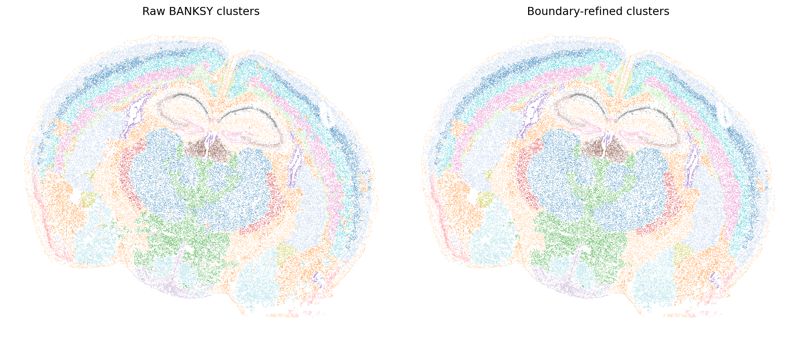

Single Clustering (CSV or AnnData Input)
========================================

Single clustering discovers spatial structures within one assay before a
cross-modality alignment. spAlignDE applies BANKSY to combine gene expression
with local spatial-neighborhood information, then optionally refines labels
with a boundary-aware vote. The workflow is identical for cell- and
spot-resolution data.

Input contract
--------------

AnnData/H5AD
^^^^^^^^^^^^

The canonical input contains:

- a cell/spot-by-gene matrix in ``adata.X`` (or a selected layer);
- unique ``adata.obs_names``; and
- finite x/y coordinates with shape ``(n_obs, 2)`` in
  ``adata.obsm["spatial"]``.

If ``obsm["spatial"]`` is absent in an H5AD file,
``load_single_sample_data`` can construct it from numeric ``obs["x"]`` and
``obs["y"]`` columns.

Paired CSV
^^^^^^^^^^

Conversion to H5AD is optional. A metadata/expression CSV pair can be loaded
directly after it has been normalized to the column contract below.

The metadata CSV requires:

.. list-table:: Metadata table
   :header-rows: 1
   :widths: 24 76

   * - Column
     - Requirement
   * - ``cell_id``
     - Unique cell or spot identifier.
   * - ``x``
     - Finite numeric x-coordinate.
   * - ``y``
     - Finite numeric y-coordinate.
   * - Other columns
     - Optional sample annotations are preserved in ``adata.obs``.

The expression CSV contains the same unique ``cell_id`` values followed by
one or more numeric, finite, non-negative gene columns. Row order may differ;
spAlignDE reorders the expression table by ``cell_id`` and rejects missing or
extra identifiers instead of silently taking an intersection. Export from
vendor-specific containers such as Seurat RDS is upstream preprocessing and
is outside the spAlignDE input interface.

.. code-block:: python

   import spAlignDE

   # AnnData or H5AD
   adata = spAlignDE.load_single_sample_data(
       "/path/to/sample.h5ad"
   )

   # Equivalent paired-CSV input
   adata = spAlignDE.load_single_sample_data(
       "/path/to/cell_metadata_sample.csv",
       expression_csv="/path/to/cell_by_gene_sample.csv",
   )

Clustering and refinement
-------------------------

.. code-block:: python

   config = spAlignDE.SingleClusteringConfig(
       num_neighbors=30,
       banksy_lambda=0.8,
       resolution=1.2,
       refine_boundaries=True,
   )

   clustered = spAlignDE.cluster_single(
       adata,
       config=config,
   )

   spAlignDE.plot_single_cluster_refinement(clustered)

   Raw and boundary-refined spatial structures for MERFISH S2R1. The classic
   ``tab20`` mapping is shared between panels, so each cluster retains the
   same color before and after boundary refinement.

The boundary-aware step uses a smaller spatial neighborhood near the tissue
edge than in the tissue interior. A label changes only when the current label
has weak local support and the proposed label exceeds its location-specific
support threshold. This helps preserve thin anatomical structures.

For a new dataset, tune ``banksy_lambda`` and ``resolution`` first while
holding the neighborhood and refinement settings fixed. Increasing
``banksy_lambda`` gives spatial-neighborhood information more influence;
increasing ``resolution`` usually produces more clusters. Select parameters by
spatial coherence, boundary preservation and downstream structure coverage,
not by matching cluster integer labels to this example. See
:doc:`Parameter Tuning Guide <parameter_tuning>` for the full sequence.

Output contract
---------------

The input expression matrix and ``obsm["spatial"]`` are preserved. The
returned AnnData adds:

- ``obs["cluster_raw"]``: selected BANKSY partition;
- ``obs["cluster_refined"]``: boundary-refined partition, when enabled;
- ``obs["cluster"]``: selected labels for downstream alignment; and
- ``uns["spAlignDE"]["single_clustering"]``: parameters and provenance.

The MERFISH S2R1 example contains 83,546 cells, 649 measured genes and 25
refined clusters. It is used as the query for the ST-to-Allen-CCF tutorial.

Troubleshooting
---------------

- If BANKSY reports no usable spatial graph, confirm finite x/y coordinates,
  remove duplicate observations and compare nearest-neighbor spacing with
  ``num_neighbors``.
- If one region fragments into many islands, reduce ``resolution`` or increase
  spatial influence gradually; if thin domains disappear, reduce neighborhood
  smoothing before changing boundary refinement.
- If a later workflow cannot reproduce UI region IDs, use the exact saved
  clustered H5AD. Cluster integers may be renumbered by a fresh run even when
  its map is similar.

Source notebook
---------------

- :doc:`Single clustering for cross-modality alignment
  <../source_notebooks/clustering/clustering_single_nb>`
