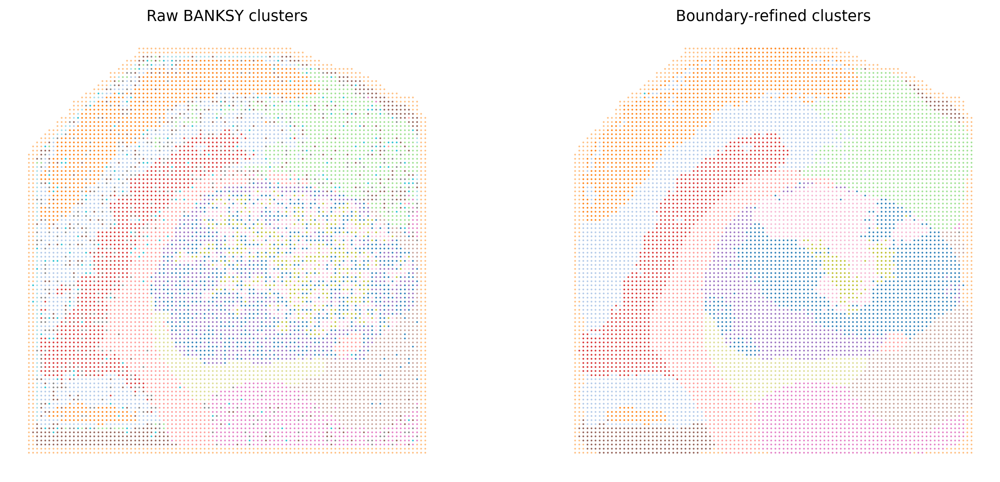
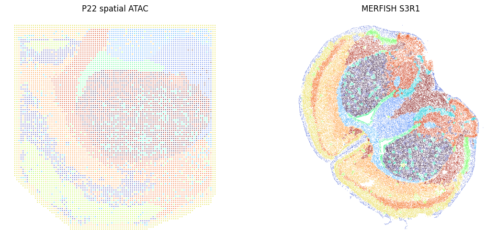
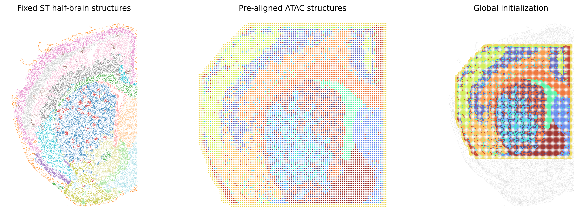
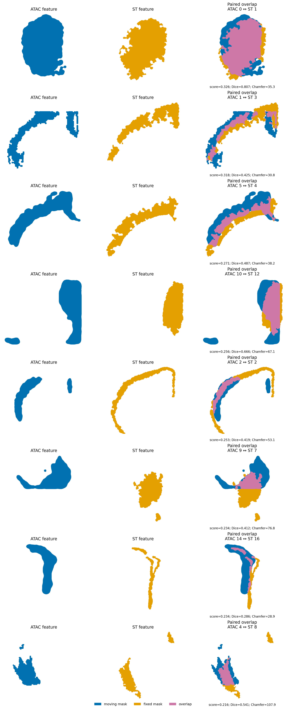
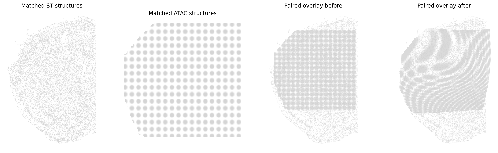
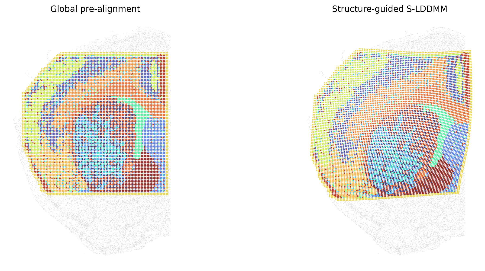

Spatial ATAC-to-ST Workflow
===========================

This workflow registers a spatial ATAC assay to an independently profiled
spatial transcriptomics (ST) reference. The moving query is the P22 mouse-brain
spatial ATAC assay (9,215 observations at 20-µm resolution), and the fixed
reference is Vizgen MERFISH S3R1 (70,844 cells before selection of the matching
half brain). The example follows the paper experiment from raw gene-activity
input through a fresh S-LDDMM run; it does not load a cached deformation.

ATAC and ST are clustered independently. Consequently, the modalities do not
need the same genes, shared feature dimensions, transferred anatomical labels,
or a joint latent representation. Cross-modality correspondence is inferred
from the geometry of their spatial structures.

Notebooks
---------

Run the two notebooks in order:

1. :doc:`Spatial ATAC single clustering — P22 mouse brain <../source_notebooks/cross_modality/atac_st_single_clustering_nb>`
   reads ATAC gene activity and coordinates, runs single-sample BANKSY, and
   writes ``p22_atac_single_clustered.h5ad``.
2. :doc:`P22 spatial ATAC to MERFISH S3R1 <../source_notebooks/cross_modality/atac_st_alignment_nb>`
   loads that clustered ATAC object and an independently clustered S3R1
   AnnData, constructs cross-modality structure fields, and reruns S-LDDMM.

The H5AD written by notebook 1 is the explicit handoff to notebook 2. This
dependency is intentional: the notebooks expose clustering and alignment as
separate, reusable stages while preserving one reproducible execution order.

Installation
------------

From the repository root:

.. code-block:: bash

   cd /path/to/spAlignDE
   python -m pip install -e ".[clustering,atlas,tutorial]"

A CUDA-capable GPU is recommended for S-LDDMM. BANKSY clustering can be run on
CPU. Dependency versions are pinned for the validated release; using different
versions can cause minor BANKSY boundary changes and label renumbering. Such
changes should be evaluated spatially rather than by comparing cluster
integers alone.

The validated release environment is pinned in the repository-level
``environment.yml``, including the exact BANKSY commit. Run the notebooks from
the repository root with that environment and do not reuse a previously
cropped ``st_reference_analysis_frame.h5ad`` as the S3R1 input: notebook 2
expects the complete 70,844-cell reference and performs the half-brain crop
once, yielding 35,422 fixed cells. Use the input files listed for this tutorial
rather than a previously cropped intermediate file.

Data sources
------------

The P22 spatial ATAC--RNA dataset is available from:

- `UCSC Cell Browser <https://brain-spatial-omics.cells.ucsc.edu/>`_
- `GEO GSE205055 <https://www.ncbi.nlm.nih.gov/geo/query/acc.cgi?acc=GSE205055>`_
- `the original Nature study <https://www.nature.com/articles/s41586-023-05795-1>`_

The fixed S3R1 ST reference is distributed as part of the
`Vizgen MERFISH Mouse Brain Receptor Map
<https://info.vizgen.com/mouse-brain-map>`_. Download the cell-by-gene and cell
metadata files for S3R1, convert them with the single-clustering loader, and
cluster the sample independently before alignment.

Input contract
--------------

Spatial ATAC query
~~~~~~~~~~~~~~~~~~

The clustering input must contain an ATAC-derived **gene-activity matrix**, not
a peak-by-observation matrix. Gene activity supplies a gene-level molecular
representation for BANKSY; after clusters are inferred, the alignment uses
spatial structures rather than shared molecular features.

AnnData/H5AD input requires:

- ``adata.X`` with shape observations by gene-activity features and
  non-negative values;
- unique ``adata.obs_names``;
- finite x/y coordinates in ``adata.obsm["spatial"]``; and
- optional metadata columns in ``adata.obs``.

The equivalent paired CSV input is:

.. code-block:: text

   atac_metadata.csv
   cell_id,x,y
   P22_0001,123.4,567.8
   P22_0002,124.1,568.2

   atac_gene_activity.csv
   cell_id,GeneA,GeneB,GeneC
   P22_0001,0,2.1,0.4
   P22_0002,1.2,0,0.8

Both files must contain the same unique ``cell_id`` values. Expression rows are
matched to metadata by identifier, not row number. A Seurat RDS is an upstream
container and must first be exported to H5AD or this paired CSV format.
Conversion to H5AD is optional. Exporting a vendor-specific object or deriving
gene activity from peaks is upstream preprocessing and is not performed by
spAlignDE.

ST reference
~~~~~~~~~~~~

The ST reference follows the same single-sample AnnData/CSV contract. Before
notebook 2, run :doc:`Single Clustering <clustering_single>` so that S3R1 has
``adata.obs["cluster"]``. The full S3R1 sample is supplied to the alignment;
the matching half-brain selection is performed and recorded by spAlignDE.

Stage 1: independent clustering
-------------------------------

The P22 ATAC settings are:

.. code-block:: python

   seed_controls = spAlignDE.set_random_seed(
       1234,
       deterministic_torch=True,
   )

   cluster_config = spAlignDE.SingleClusteringConfig(
       num_neighbors=30,
       banksy_lambda=0.6,
       resolution=1.0,
       pca_dim=20,
       max_m=1,
       decay="scaled_gaussian",
       random_state=1234,
       refine_boundaries=True,
   )

   clustered, details = spAlignDE.cluster_single(
       atac,
       config=cluster_config,
       return_details=True,
   )

The fixed result contains 17 ``cluster_raw``, ``cluster_refined``, and
``cluster`` structures, with exact labels in two fresh processes. The
paper ATAC-to-ST workflow uses ``cluster_raw`` as its structure partition and
retains refined labels for boundary QC. This avoids making the alignment
dependent on an additional local-voting decision.

   Independent single-sample clustering of the ATAC query. Raw and refined
   panels use the same classic ``tab20`` mapping so boundary changes do not
   masquerade as cluster-identity changes.

   Independently inferred structures before correspondence selection. Their
   integer labels and colors are modality-specific at this checkpoint; only
   geometry is used to identify candidate cross-modality pairs.

Stage 2: global pre-alignment
-----------------------------

The ATAC query and ST reference are placed in one analysis frame with global
similarity transforms. The left half of transformed S3R1 is retained because
the ATAC assay represents a partial section.

.. code-block:: text

   ST:   rotation -125°, scale 1.0, translation (0, 0)
   ATAC: rotation  -90°, scale 1.6, translation (-2600, -3300)
   ST crop: x-axis, left side, split quantile 0.5
   raster scale: 0.25
   canvas padding: 10

.. code-block:: python

   prealigned = spAlignDE.prealign_atac_to_st(
       atac,
       st_reference,
       config=spAlignDE.ATACSTPrealignmentConfig(),
       atac_cluster_key="cluster_raw",
       st_cluster_key="cluster",
   )

These are whole-sample initialization parameters. They do not encode a
hippocampal or other region identity. For a new tissue section, first tune and
inspect a global manual pre-alignment and field-of-view crop; do not compensate
for a poor initialization by assigning a special anatomical weight.

Tune ``reference_crop_axis``, ``reference_crop_side`` and
``reference_crop_quantile`` only after the two global transforms place the
same partial anatomy in view. ``raster_scale`` controls canvas resolution: a
larger value retains more detail and costs more memory, while distance-based
parameters are then interpreted in the new canvas units.

   Global similarity transforms place both assays in one frame and the
   matching half-brain field of view is retained. Verify this crop before
   tuning pair scores or deformation parameters.

Stage 3: masks and automatic structure pairing
-----------------------------------------------

For each independent cluster, spAlignDE removes sparse coordinate outliers,
rasterizes the point cloud, smooths and closes the field, fills holes, and
retains the principal connected components. Narrow and broad structures use
different mask-smoothing regimes to avoid erasing slender regions or
fragmenting large ones.

All ATAC/ST candidates are scored by one global geometric rule:

.. math::

   S = 0.35 S_{\mathrm{SDF}}
       + 0.25 S_{\mathrm{Chamfer}}
       + 0.30 S_{\mathrm{area}}
       + 0.10 S_{\mathrm{Dice}}.

A logistic gate globally downweights pairs with large boundary Chamfer
distance. Candidates require an alignment score of at least 0.21 and Dice
overlap of at least 0.01. Greedy selection then produces a one-to-one set of
structure pairs. No anatomical names or region-specific weights enter this
step.

With the fixed inputs and seed ``1234``, this threshold retains eight pairs.
The accepted pair table and pair scores were identical in an independent
repeat; float64 aligned coordinates agreed within ``1e-12``.

Stage 4: structure-guided S-LDDMM
---------------------------------

Accepted masks are converted to signed-distance-transform channels. A global
inverse-area channel balance prevents broad masks from overwhelming narrow
ones; the same rule is applied to every channel. S-LDDMM estimates a smooth
diffeomorphic field and maps every ATAC observation, including observations
outside the matched masks.

The paper settings are:

.. code-block:: text

   nt = 8
   niter = 500
   diffeo_start = 20
   a = 100
   p = 2
   grid_step = 50
   epL = 2e-11
   epT = 2e-5
   epM = 1e3
   sigmaR = 1e6
   sigmaM = 0.5

For numerical stability, the optimizer clips the momentum gradient, reduces a
common step scale after an energy increase, rejects non-finite or singular
affine updates, and retains the final optimizer iterate
(``restore_best_checkpoint=False``). This is the package-wide default because
EM intensity updates can change the objective scale. These safeguards are
global optimization rules and do not inspect structure labels or anatomy.

For a new dataset, inspect accepted and rejected masks before changing
``pair_score_threshold`` or ``pair_dice_threshold``. Adjust the SDF, Chamfer,
area and Dice weights only as one global rule and keep their sum equal to one.
``channel_area_power`` controls inverse-area balancing and can give narrow masks
more influence without naming an anatomical region. The ATAC values ``a=100``
and ``grid_step=50`` belong to the cropped raster canvas. See the
:ref:`cross-modality pairing-weight guide <cross_modality_pairing_weights>`
for component-specific tuning and :doc:`Parameter Tuning Guide
<parameter_tuning>` for the full dependency and failure checklist.

.. code-block:: python

   result = spAlignDE.align_atac_to_st(
       prealigned,
       config=spAlignDE.ATACSTAlignmentConfig(
           restore_best_checkpoint=False,
           dtype="float64",
       ),
       atac_cluster_key="cluster_raw",
       st_cluster_key="cluster",
       output_dir="tutorials/cross_modality/atac/output/alignment",
   )

Paired-feature overlap quality control
~~~~~~~~~~~~~~~~~~~~~~~~~~~~~~~~~~~~~~

Review every accepted binary-mask pair before interpreting the final
deformation. Blue is the moving ATAC feature, orange is the fixed ST feature
and purple is their intersection. The pair score combines the global matching
terms; Dice measures area overlap, whereas Chamfer distance remains sensitive
to displaced boundaries. These are the exact masks stacked into the S-LDDMM
source and target channels.

   Moving ATAC mask (blue), fixed ST mask (orange) and intersection (purple)
   for all eight accepted feature pairs, with score, Dice and Chamfer distance.

The shared-color point panels then show the independently inferred structures
and their correspondence before and after S-LDDMM. Shared colors indicate
accepted pairs, whereas gray points were not used as matched channels. A
convincing whole-tissue outline is not a substitute for compatible
paired-feature geometry.

   Selected ST structures, their paired ATAC structures, and paired-feature
   overlaps before and after deformation. Pair colors are assigned only after
   automatic geometric matching and expose which features actually drive
   S-LDDMM.

   Global pre-alignment (left) versus the final structure-guided alignment
   (right). All ATAC observations are displayed, including observations not
   used in a matched-mask channel.

Outputs
-------

The aligned ATAC AnnData retains the original gene-activity matrix,
``obsm["spatial"]``, observation identifiers, and metadata. It adds the
package-wide coordinate contract:

.. code-block:: text

   x_prealigned
   y_prealigned
   x_aligned
   y_aligned

The cropped, fixed ST reference receives the same columns; its prealigned and
aligned coordinates are identical. Parameters and provenance are stored only
under the case-preserving ``adata.uns["spAlignDE"]`` namespace.

The alignment output directory contains:

.. code-block:: text

   atac_to_st_aligned.h5ad
   st_reference_analysis_frame.h5ad
   matched_structure_pairs.csv
   candidate_structure_pairs.csv
   atac_mask_summary.csv
   st_mask_summary.csv
   alignment_manifest.json

Quality control
---------------

Review the workflow at four checkpoints:

1. Confirm the ATAC gene-activity matrix, observation count, spatial array, and
   independently inferred cluster map.
2. Inspect the global ATAC/ST overlay after the ST half-brain crop. Tissue
   coverage must correspond before structure matching.
3. Inspect accepted pairs with shared colors. A large unmatched gray region is
   preferable to forcing an implausible pair.
4. Compare global pre-alignment with final S-LDDMM coordinates and verify that
   all 9,215 ATAC observations are retained.

Matched masks are optimization inputs. Anatomical label agreement or local
neighborhood preservation should be calculated afterward as independent
evaluation metrics, not used to select a deformation that favors one region.

For the fixed final alignment, mean within-ATAC neighborhood preservation at
``k = 10, 20, 30, 50`` is ``0.8941``, ``0.9756``, ``0.9167`` and ``0.9288``,
respectively. These values are calculated by intersecting each observation's
original and aligned ``k``-nearest-neighbor sets and dividing by ``k``. They
therefore support the manuscript's rounded range ``0.89–0.98``. This is a
downstream quality-control calculation and is not used for pair selection or
parameter tuning.
