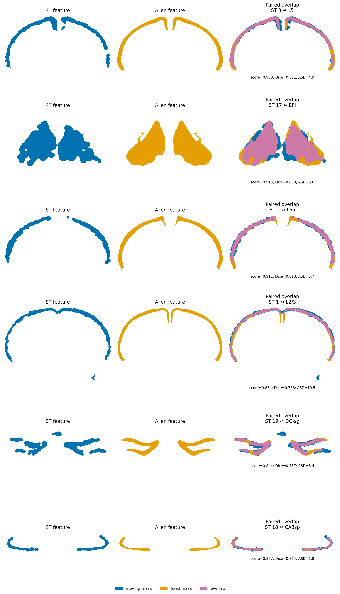
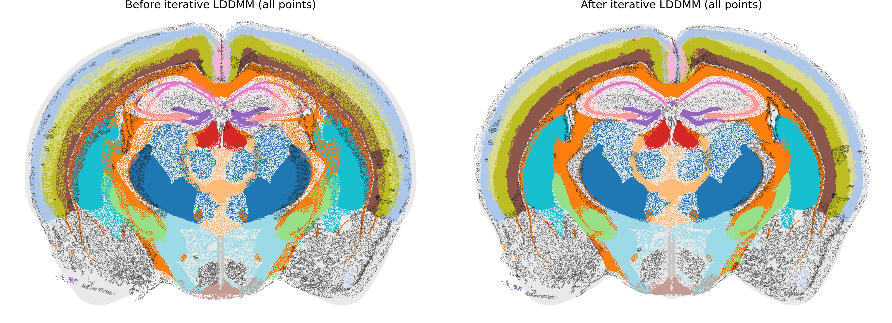
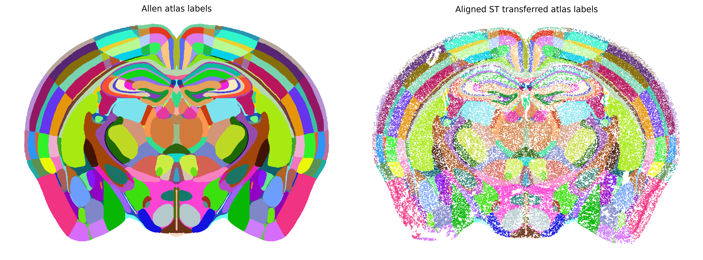

.. _st-to-allen-ccf-tutorial:

ST-to-Allen-CCF Alignment — MERFISH Adult Mouse Brain
=====================================================

Overview
--------

spAlignDE aligns one spatial transcriptomics (ST) sample to an annotated 2D
Allen Common Coordinate Framework (CCF) slice without requiring shared
molecular features. The example maps adult mouse brain MERFISH sample S2R1
(83,546 cells) to Allen CCF 2022 coronal slice 675, then transfers Allen labels
back to every aligned cell.

The workflow has five stages:

1. discover ST spatial structures with single-sample BANKSY;
2. build expression-based coarse-to-fine ST structure levels;
3. estimate whole-tissue rotation, isotropic scale and translation;
4. pair ST masks with hierarchical Allen structures and refine the mapping by
   coarse-to-fine S-LDDMM; and
5. sample the atlas annotation at each final aligned ST coordinate.

Input data
----------

Query ST AnnData
^^^^^^^^^^^^^^^^

Run :doc:`Single Clustering <clustering_single>` first. The alignment input
requires:

- ``adata.X``: cell/spot-by-gene expression matrix;
- ``adata.obsm["spatial"]``: original finite x/y coordinates;
- ``adata.obs_names``: unique observation identifiers; and
- ``adata.obs["cluster"]``: selected single-sample spatial labels.

The same clustering tutorial accepts either H5AD or paired CSV input, so the
Atlas workflow itself uses one normalized AnnData contract.

Allen CCF reference
^^^^^^^^^^^^^^^^^^^

Two files from the `Allen CCF 2022 annotation release
<https://download.alleninstitute.org/informatics-archive/current-release/mouse_ccf/annotation/ccf_2022/>`_
are required:

.. list-table:: Atlas files
   :header-rows: 1
   :widths: 32 68

   * - File
     - Use
   * - ``annotation_10.nrrd``
     - Integer annotation volume at 10-µm resolution. The example extracts
       coronal slice 675; label 0 remains background.
   * - ``voxel_count_and_differences.csv``
     - Annotation ID, structure name/acronym, hierarchy path and Allen display
       color used to construct candidate regions and transferred labels.

The ST data are available from the `Vizgen Mouse Brain Receptor Map
<https://info.vizgen.com/mouse-brain-map>`_. The documented query is S2R1.

.. code-block:: python

   import spAlignDE

   seed_controls = spAlignDE.set_random_seed(
       1234,
       deterministic_torch=True,
   )

   adata = spAlignDE.load_single_sample_data(
       "tutorials/cross_modality/atlas/output/merfish_S2R1_single_clustered.h5ad"
   )

   atlas = spAlignDE.load_allen_ccf_reference(
       "data/allen_ccf_2022/annotation_10.nrrd",
       "data/allen_ccf_2022/voxel_count_and_differences.csv",
       slice_index=675,
   )

Coarse-to-fine ST structures
----------------------------

The finest partition is ``adata.obs["cluster"]``. To build coarser levels,
spAlignDE log-transforms expression, retains genes accounting for a chosen
cumulative fraction of gene-wise variance, computes standardized
cluster-average profiles and applies Ward linkage. With 25 final S2R1
clusters and three levels in the documented environment, the automatic
hierarchy contains 7, 16 and 25 structures. The coarsest level retains at
least seven structures so the initial deformation is supported by multiple
anatomical anchors. These are ST-only levels: Allen hierarchy candidates from
depths 2–10 remain eligible at every stage. There is no stage-specific Atlas
depth restriction and no structure-specific matching rule.

.. code-block:: python

   config = spAlignDE.STAtlasAlignmentConfig(
       n_levels=3,
       minimum_coarse_structures=7,
       variance_fraction=0.8,
       min_genes=50,
       pairing_weight_sdf=0.05,
       pairing_weight_chamfer=0.05,
       pairing_weight_dice=0.20,
       pairing_weight_area=0.50,
       pairing_weight_thickness=0.20,
       continuation_kernel_scale=200,
       continuation_velocity_grid_spacing=50,
       continuation_restore_best_checkpoint=False,
       pairing_dice_soft=0.25,
   )

   adata, hierarchy_columns = spAlignDE.build_st_cluster_hierarchy(
       adata,
       config=config,
       cluster_key="cluster",
   )

.. figure:: ../_static/tutorial_figures/single_clustering_tab20.png
   :alt: Single-sample BANKSY clustering for MERFISH S2R1
   :width: 100%
   :align: center

   Raw and boundary-refined MERFISH S2R1 structures used to initialize the ST
   hierarchy. Colors are fixed across panels; cluster integers are identifiers,
   not Allen labels.

Whole-tissue pre-alignment
--------------------------

Let :math:`M_{ST}(T)` denote the rasterized whole-ST mask after similarity
transform :math:`T`, and :math:`M_A` the non-background atlas mask. spAlignDE
searches rotation and scale settings, solves translation by mask centers and
selects the transformation maximizing

.. math::

   \operatorname{IoU}(T)
   = \frac{|M_{ST}(T) \cap M_A|}{|M_{ST}(T) \cup M_A|}.

Reflection is disabled by default. The resulting coordinates are written to
``x_prealigned`` and ``y_prealigned``.

Hierarchical structure pairing
------------------------------

ST clusters are converted to adaptive smoothed masks. Atlas candidates are
formed directly from the annotation hierarchy: a hierarchy prefix represents
the union of all descendant annotation IDs, while cortical layers are handled
as explicit label unions.

For an ST mask :math:`C` and atlas candidate :math:`A`, the main alignment
score is

.. math::

   S(C,A) =
   0.05S_{\mathrm{SDF}} +
   0.05S_{\mathrm{Chamfer}} +
   0.20D_{\mathrm{Dice}} +
   0.50S_{\mathrm{area}} +
   0.20S_{\mathrm{thickness}}.

The five weights sum to one. Area and thickness are intentionally treated as
first-class shape evidence so a narrow laminar ST structure is not assigned to
a broader neighboring atlas region merely because that region has higher
local overlap. This is a global score used for every candidate, not a
hippocampus-specific rule. Dice has a soft gate at 0.25; average surface
distance is retained as an independent QC gate rather than added to the
weighted sum. Candidate pairs require gated score at least 0.50 and average
surface distance no greater than 50 pixels. Greedy selection then enforces one
ST structure per atlas structure and prevents overlapping atlas label unions.

UI-curated pairing alternative
------------------------------

When geometry-only candidate discovery remains ambiguous, the interactive
region-pairing tool can be used to define biologically reviewed many-to-many
correspondences. Export the pairs as CSV and keep the exact clustered AnnData
used in that UI session; ST cluster integers may change after a clustering
rerun.

.. code-block:: python

   pairing = spAlignDE.load_ui_atlas_pairing(
       "spalign_de_experimental_pairs.csv",
       expected_atlas_slice=atlas.slice_index,
   )

   result = spAlignDE.align_st_to_allen_atlas_from_ui_pairs(
       adata,
       atlas,
       pairing,
       config=spAlignDE.UIAtlasAlignmentConfig(
           kernel_scale=200,
           time_steps=5,
           velocity_grid_spacing=50,
           iterations=500,
           restore_best_checkpoint=False,
       ),
       output_dir="st_to_atlas_ui_output",
   )

Each ``group_id`` is converted to one S-LDDMM channel by unioning all selected
ST clusters and Allen labels in that group. These pairs are accepted directly:
automatic candidate discovery, pair scoring/gating, non-overlap selection and
pair rematching are skipped. The ``matched_pairs`` result field contains
normalized UI pair provenance rather than newly inferred pairs.

The remaining alignment preparation is still required. The function performs
point filtering, ST and Allen mask construction, mask cleanup, signed-distance
conversion, channel weighting, S-LDDMM input construction, deformation and
label transfer. With ``prealignment_mode="mask"`` it also computes whole-mask
initialization. If manual pre-alignment has already populated
``adata.obs["x_prealigned"]`` and ``adata.obs["y_prealigned"]``, use
``prealignment_mode="provided"``; only transform estimation is skipped. Mask
preprocessing and area balancing apply globally in both modes, with no
anatomy-specific weight.

S-LDDMM refinement
------------------

Every accepted mask pair is converted to matched signed-distance channels.
S-LDDMM estimates an initial momentum :math:`m_0`, integrates its velocity
field and minimizes a structure-matching term plus deformation regularization:

.. math::

   E(m_0, A) =
   E_{\mathrm{structure}}\!\left(I \circ \phi^{-1} \circ A^{-1}, J\right)
   + \frac{1}{2\sigma_R^2}
     \int_0^1 \langle m_t, v_t \rangle\,dt.

Here :math:`A` is the affine component and :math:`\phi` is the diffeomorphic
flow. The mapping is estimated successively from coarse to fine ST levels and
applied to all cells, including cells removed from mask construction as local
outliers.

.. code-block:: python

   result = spAlignDE.align_st_to_allen_atlas(
       adata,
       atlas,
       config=config,
       cluster_key="cluster",
       output_dir="tutorials/cross_modality/atlas/output/fresh_alignment",
   )

   spAlignDE.plot_st_atlas_alignment(
       result,
       cluster_key="cluster",
       structure_color_map=spAlignDE.load_atlas_structure_color_map(),
       point_size=1.0,
   )

Matched ST clusters and Allen structures share a fixed structure-name color in
this view. The built-in mapping preserves the clearer palette from the
validated analysis notebook even when cluster numbering or matched-pair order
changes. Unmatched atlas regions are light gray and unmatched ST cells are
dark gray.

Paired-feature overlap quality control
^^^^^^^^^^^^^^^^^^^^^^^^^^^^^^^^^^^^^^

Inspect the binary masks accepted by the final matching stage before
interpreting the deformation. Blue is the moving ST feature, orange is its
Allen target and purple is their intersection. Dice measures area overlap,
whereas ASD remains sensitive to displaced boundaries and width differences in
thin structures. The panel shows the six pairs with the highest global gated
score; the notebook displays the complete 17-pair table. This is a global
score-based display rule and does not give any anatomical region special
priority.

   Moving ST mask (blue), Allen target mask (orange) and intersection (purple)
   for the six highest-scoring accepted pairs. The reported gated score, Dice
   and ASD are calculated from these same matching masks.

The shared-color point overlay provides the complementary whole-section audit.
In the left panel, verify that every pre-aligned ST feature occupies the
intended Allen structure with compatible position, width and boundary shape.
The right panel shows the deformation driven by those same accepted channels.
A good post-alignment outline must not be used to rescue a pair that was
anatomically implausible before deformation.

   Paired-feature overlap before (left) and after (right) hierarchical
   S-LDDMM. Each selected ST/Allen feature pair shares one color, making
   incorrect width, position, or boundary correspondence visible before label
   transfer.

Atlas label transfer
--------------------

After alignment, spAlignDE converts every final physical coordinate to an
atlas pixel and samples its integer annotation ID. It attaches the Allen ID,
acronym, full name and transfer status to ``result.adata.obs``. Label 0 is
retained as background/unlabeled instead of being replaced by a nearby
region.

.. code-block:: python

   color_map = spAlignDE.load_atlas_label_color_map(
       result.output_dir
       / "atlas_z675_white_label_color_map_for_transfer_labels.csv",
       atlas=result.atlas,
   )
   spAlignDE.plot_atlas_label_transfer(
       result,
       color_map=color_map,
       point_size=2.0,
       point_alpha=0.8,
   )

The atlas panel and transferred-label panel use exactly the same fixed color
for every annotation ID; label 0 remains white.

   Allen annotation slice 675 (left) and labels sampled at the final aligned
   MERFISH coordinates (right). Identical label colors allow a direct visual
   audit of transfer coverage and background cells.

In the fixed-seed three-stage run, the scheduled stages accept 3, 7 and 15
structure pairs. Continuation re-scores 15 pairs before its first deformation,
increases the set to 17, and runs one stopping cycle that remains at 17. The
completed stopping-cycle transform is retained; continuation does not restore
an earlier energy checkpoint. The hippocampal correspondences include CA3sp,
DG-sg and CA1sp.

The complete fixed run retains all 83,546 cells and takes 13.7 minutes with
0.839 GiB peak CUDA allocation in the documented environment. Exact label
coverage is reported by the freshly executed notebook rather than copied from
an earlier uncontrolled result.

Output contract
---------------

The returned ``STAtlasAlignmentResult`` contains:

- ``adata``: original expression and spatial coordinates plus
  ``x_prealigned``, ``y_prealigned``, ``x_aligned``, ``y_aligned`` and Allen
  label columns;
- ``matched_pairs``: final ST-to-atlas structure correspondences and component
  metrics;
- ``stage_summary``: structure-pair count and LDDMM status for every level;
- ``atlas``: selected annotation slice and hierarchy table; and
- ``prealignment_parameters``: selected whole-tissue similarity transform.

Fresh runs write ``st_to_allen_atlas_aligned.h5ad``, the ST hierarchy table,
stage and pair CSV files, and before/after QC figures. Configuration and
provenance use the canonical ``adata.uns["spAlignDE"]`` namespace.

Quality control
---------------

Inspect four checkpoints before downstream interpretation:

- the single-cluster raw/refined spatial map;
- whole-tissue IoU pre-alignment on the selected atlas slice;
- stage-specific pair counts and component metrics; and
- final alignment geometry and the fraction assigned to atlas background.

Parameter adaptation
--------------------

Tune Atlas alignment in this order: confirm slice/orientation, inspect the
single-cluster map, validate the three-level hierarchy, check whole-tissue
pre-alignment, review component metrics for every accepted/rejected pair, and
only then adjust deformation settings. ``n_levels`` changes the number of
coarse-to-fine deformation stages. The pairing weights must remain
non-negative and sum to one; change them globally rather than assigning a
special weight to a named structure. Raising ``pairing_score_threshold`` or
lowering ``pairing_max_asd`` makes pair acceptance stricter. Detailed guidance
for area/thickness balance and score weights is in the
:ref:`cross-modality pairing-weight guide <cross_modality_pairing_weights>`;
the full gate and failure-mode checklist is in :doc:`Parameter Tuning Guide
<parameter_tuning>`.

The Atlas workflow currently uses a validated stage-specific S-LDDMM schedule
internally, so ``STAtlasAlignmentConfig`` does not accept the single
``kernel_scale``/``grid_step`` pair used by cross-sample alignment. Passing a
``SLDDMMConfig`` does not modify Atlas stages.

Troubleshooting
---------------

- A high whole-mask IoU with wrong internal anatomy usually indicates the
  wrong atlas slice/orientation or an uninformative tissue outline; fix that
  before pair thresholds.
- If no pair survives, inspect ST/Allen masks and candidate component metrics.
  Relaxing the final score gate cannot recover a missing or fragmented mask.
- If a narrow layer maps to a broad neighbor, inspect the three hierarchy
  levels and global area/thickness terms. Do not add a structure-name-specific
  weight.
- For UI pairs, validate ``atlas_z_slice``, ``group_id`` unions and exact ST
  cluster IDs. ``prealignment_mode="provided"`` requires finite pre-aligned
  columns but still runs mask preparation and deformation.

Source notebooks
----------------

- :doc:`Single clustering for cross-modality alignment
  <../source_notebooks/clustering/clustering_single_nb>`
- :doc:`MERFISH S2R1 to Allen CCF slice 675
  <../source_notebooks/cross_modal_atlas_alignment_nb>`
- :doc:`Interactive region pairing and refinement
  <../source_notebooks/cross_modality/interactive_region_pairing_nb>`
- :doc:`UI-curated ST-to-Allen-CCF alignment — MERFISH S2R1
  <../source_notebooks/cross_modality/ui_paired_atlas_alignment_nb>`
