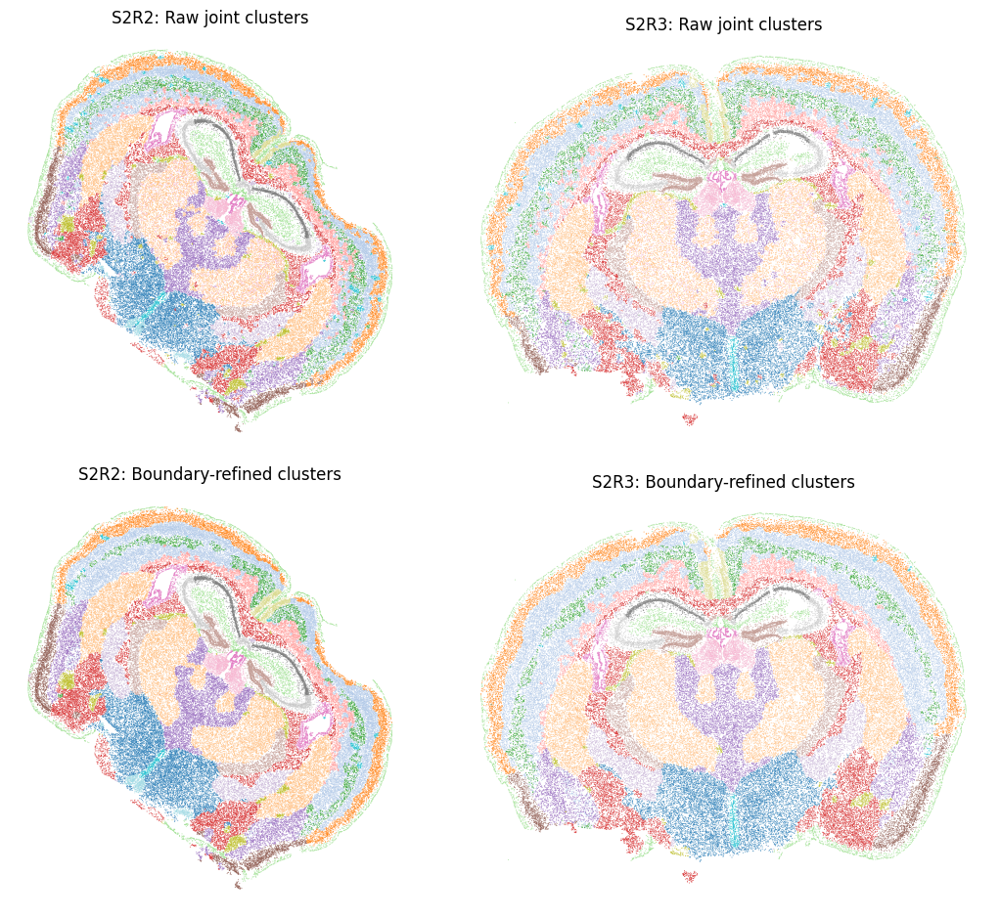
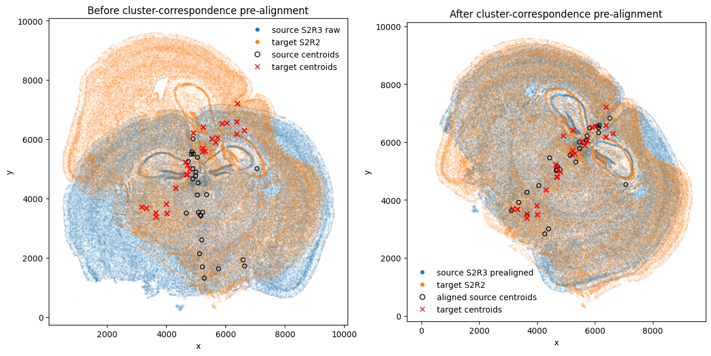
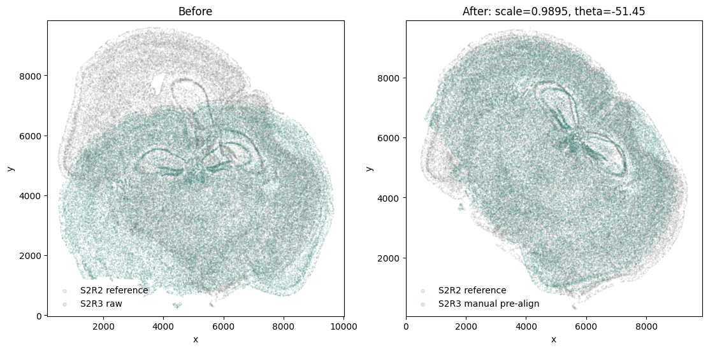
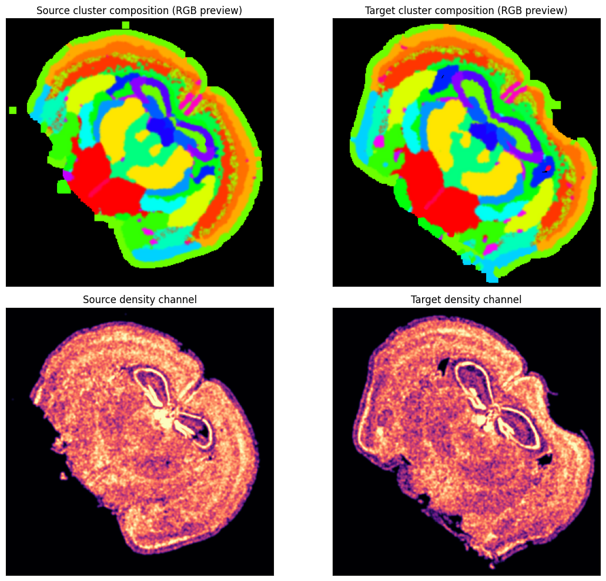
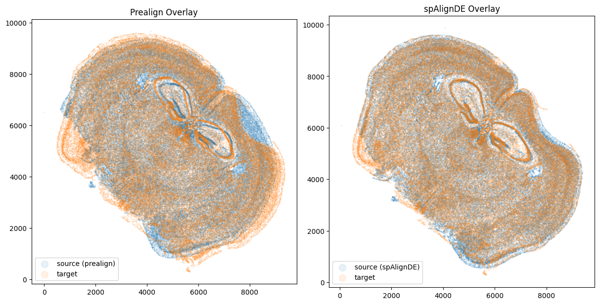
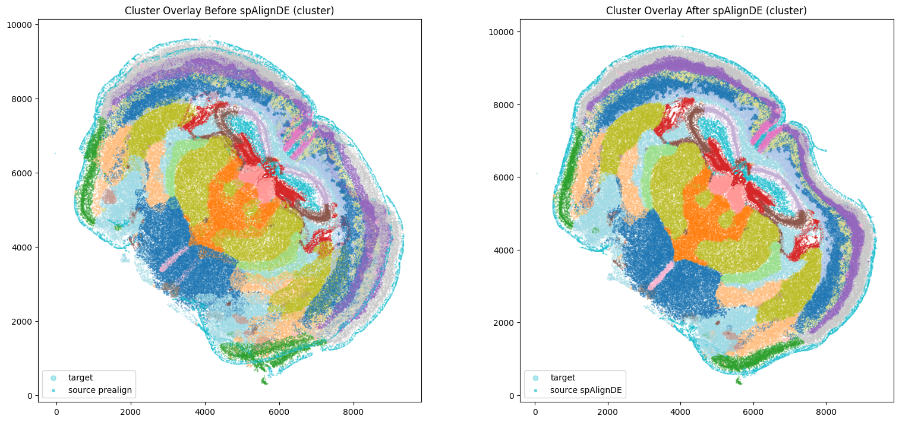

Cross-Sample Alignment - Two Adult Mouse Brain Sections from MERFISH
====================================================================

spAlignDE aligns a moving spatial transcriptomics sample (the **query**) to a
fixed sample (the **reference**). Input may be supplied as paired CSV files or
as a combined ``AnnData``/``.h5ad`` object. spAlignDE normalizes either route
to one combined ``AnnData`` object, which is then used throughout the workflow:

1. identify shared spatial structures by joint BANKSY/Harmony/Leiden
   clustering;
2. estimate a global query-to-reference similarity transformation;
3. rasterize shared-cluster composition and tissue density; and
4. refine the alignment with shooting-based LDDMM (S-LDDMM).

Installation
------------

Clone the repository, enter its root directory and install the package with the
optional clustering and tutorial dependencies:

.. code-block:: bash

   cd /path/to/spAlignDE
   python -m pip install -e ".[clustering,tutorial]"

The clustering extra installs BANKSY, Scanpy and Harmony. A CUDA-enabled PyTorch
installation is recommended for S-LDDMM on large datasets; the alignment API
also supports ``device="cpu"`` for small tests.

Example data
------------

The tutorial uses two biological replicates from the `Vizgen MERFISH Mouse
Brain Receptor Map <https://info.vizgen.com/mouse-brain-map>`_. These
single-cell-resolution data contain 649 measured genes:

.. list-table::
   :header-rows: 1
   :widths: 22 22 20 36

   * - Sample
     - Alignment role
     - Cells
     - Description
   * - ``S2R3``
     - Query
     - 85,958
     - Moving section transformed into the S2R2 coordinate frame.
   * - ``S2R2``
     - Reference
     - 84,172
     - Fixed section defining the output coordinate frame.
   * - Combined
     - —
     - 170,130
     - Input to joint clustering.

The Vizgen files are not bundled with the Python package. The two sections may
be provided as one combined file named, for example,
``merfishS2_joint.h5ad``, or directly as paired metadata and expression CSV
files. Conversion to H5AD is optional. Point the first notebook to either the
H5AD file or CSV directory:

.. code-block:: bash

   cd /path/to/spAlignDE
   export SPALIGNDE_INPUT=/path/to/data/merfishS2_joint.h5ad
   # Alternatively:
   # export SPALIGNDE_INPUT=/path/to/data/csv_folder
   jupyter lab source_notebooks/clustering/clustering_joint_nb.ipynb

Users may substitute any cross-sample ST dataset that satisfies either input
format below. Cell- and spot-resolution inputs use the same interface.

.. _cross-sample-csv-format:

CSV input format
----------------

.. include:: ../_includes/cross_sample_csv_contract.inc

Load the directory directly:

.. code-block:: python

   import spAlignDE

   adata = spAlignDE.load_cross_sample_data("/path/to/data/csv_folder")

The sample identifier is parsed from each filename. At least two matched file
pairs are required for joint clustering. Vendor exports must be renamed to
this file and column format before loading; conversion from vendor-specific
containers is upstream preprocessing and is not performed by spAlignDE.

AnnData input format
--------------------

Before clustering
~~~~~~~~~~~~~~~~~

The combined object must contain:

.. list-table::
   :header-rows: 1
   :widths: 25 20 55

   * - Location
     - Required key
     - Description
   * - ``adata.X``
     - —
     - Cell/spot-by-gene expression matrix.
   * - ``adata.obs``
     - ``sample_id``
     - Sample identity for every observation; at least two samples are
       required.
   * - ``adata.obsm``
     - ``spatial``
     - Finite numeric ``n_obs × 2`` matrix ordered as x then y.
   * - ``adata.obs_names``
     - —
     - Globally unique cell or spot identifiers.

The original expression matrix and ``adata.obsm["spatial"]`` are immutable
inputs. Joint clustering returns a copy by default and adds raw, refined and
selected shared-structure labels to ``adata.obs``.

Validate a new input with:

.. code-block:: python

   import spAlignDE

   adata = spAlignDE.load_cross_sample_data(
       "/path/to/data/combined_samples.h5ad"
   )
   spAlignDE.validate_cross_sample_anndata(
       adata,
       require_cluster=False,
   )

After clustering
~~~~~~~~~~~~~~~~

The alignment stage additionally requires:

.. list-table::
   :header-rows: 1
   :widths: 25 20 55

   * - Location
     - Required key
     - Description
   * - ``adata.obs``
     - ``cluster``
     - Shared spatial-structure identity in one label namespace across the
       query and reference.

Clusters need not all occur in both samples. Only the intersection of query
and reference labels contributes to the centroid fit and multichannel
rasterization.

Notebook 1: joint clustering
----------------------------

:doc:`Joint clustering — two adult mouse brain sections from MERFISH
<../source_notebooks/clustering/clustering_joint_nb>`

The first notebook calculates BANKSY features independently within each tissue
section, performs joint PCA, corrects the representation by ``sample_id`` with
Harmony, and applies Leiden clustering to a shared-nearest-neighbor graph.
Boundary-aware label refinement is performed separately within each section.
The executable notebook displays both samples side by side, with raw joint
clusters in the top row and boundary-refined clusters in the bottom row. A
shared color mapping makes cluster identities comparable across all four
panels.

The manuscript defaults are exposed through ``JointClusteringConfig``:

.. code-block:: python

   import spAlignDE

   seed_controls = spAlignDE.set_random_seed(
       1000,
       deterministic_torch=True,
   )

   clustered = spAlignDE.cluster_joint(
       adata,
       config=spAlignDE.JointClusteringConfig(
           num_neighbors=30,
           banksy_lambda=0.8,
           pca_dim=20,
           snn_neighbors=50,
           resolution=1.4,
           refine_boundaries=True,
           random_state=1000,
           leiden_flavor="leidenalg",
           leiden_n_iterations=-1,
       ),
   )

   clustered.write_h5ad(
       "tutorials/cross_sample/output/merfish_S2_joint_clustered.h5ad"
   )

The returned object has the original ``(170130, 649)`` shape in the MERFISH
example; BANKSY-expanded features are used internally and do not replace
``adata.X``. The raw, refined, and selected final labels are stored as
``cluster_raw``, ``cluster_refined``, and ``cluster`` in ``adata.obs``.
The fixed-seed run contains 28 raw clusters and 27 refined/final clusters;
the two fresh-process label vectors are identical.

   Raw joint clusters (top) and boundary-refined clusters (bottom) in both
   sections. One ``tab20`` label map is used across all panels; matching
   colors therefore represent the same shared structure identity.

Notebook 2: alignment
---------------------

:doc:`Pre-alignment, rasterization and S-LDDMM
<../source_notebooks/cross_sample_alignment_nb>`

Open the second notebook after the clustered H5AD file has been created:

.. code-block:: bash

   cd /path/to/spAlignDE
   jupyter lab source_notebooks/cross_sample_alignment_nb.ipynb

To use a clustered file in another location:

.. code-block:: bash

   export SPALIGNDE_CLUSTERED_H5AD=/path/to/data/clustered_samples.h5ad

Global similarity pre-alignment
~~~~~~~~~~~~~~~~~~~~~~~~~~~~~~~

Let :math:`\boldsymbol{\mu}^{q}_{r}` and
:math:`\boldsymbol{\mu}^{f}_{r}` be the query and fixed-reference centroids of
shared structure :math:`r`. spAlignDE estimates scale :math:`s`, rotation
:math:`R`, and translation :math:`\boldsymbol{t}` by weighted Procrustes:

.. math::

   \underset{s,R,\boldsymbol{t}}{\operatorname{argmin}}
   \sum_{r \in \mathcal{R}}
   w_r \left\|
   sR\boldsymbol{\mu}^{q}_{r}+\boldsymbol{t}
   -\boldsymbol{\mu}^{f}_{r}
   \right\|_2^2,
   \qquad
   w_r=\min(n^q_r,n^f_r).

Scaling is enabled and reflection is disabled by default. The fitted
transformation is applied to every query observation and written to
``x_prealigned`` and ``y_prealigned``.

   Query and reference cells and their shared-cluster centroids before and
   after the global similarity transform. Centroid correspondence should be
   anatomically plausible before rasterization or S-LDDMM is attempted.

Optional interactive manual pre-alignment
~~~~~~~~~~~~~~~~~~~~~~~~~~~~~~~~~~~~~~~~~

The package provides four ``ipywidgets`` sliders for manually adjusting scale,
rotation angle, x translation and y translation. The notebook initializes the
controls from the automatic weighted-Procrustes result. This option is useful
when partial tissue coverage or imperfect shared-cluster correspondence makes
the automatic initialization anatomically implausible.

Create the interactive panel directly through the public API:

.. code-block:: python

   initial = spAlignDE.ManualPrealignmentConfig(
       scale=automatic.params["scale"],
       theta_deg=automatic.params["theta_deg"],
       translation_x=automatic.params["translation_x"],
       translation_y=automatic.params["translation_y"],
   )

   manual_ui = spAlignDE.interactive_manual_prealignment(
       clustered,
       query_sample="S2R3",
       reference_sample="S2R2",
       initial_config=initial,
   )

After adjusting the sliders, apply the selected values through the same
controller. The returned object has the standard ``PrealignmentResult`` type:

.. code-block:: python

   pre = manual_ui.apply()

The current transform is also available as ``manual_ui.selected_config``. For
a reproducible non-interactive run, construct and apply the configuration
directly:

.. code-block:: python

   manual = spAlignDE.ManualPrealignmentConfig(
       scale=0.997,
       theta_deg=-50.8,
       translation_x=-1212.4,
       translation_y=6857.3,
   )

   pre = spAlignDE.prealign_cross_sample_manual(
       clustered,
       query_sample="S2R3",
       reference_sample="S2R2",
       config=manual,
   )

The notebook uses ``PREALIGNMENT_MODE = "manual"`` to select the interactive
result for downstream rasterization and S-LDDMM. A static, non-widget preview
is available through ``spAlignDE.plot_manual_prealignment_preview``.

   The notebook keeps a static preview of the widget state so scale, rotation,
   and translation can be reviewed in the rendered documentation. The query
   outline should cover the same anatomy as the fixed reference without local
   warping at this stage.

The transformation follows
``aligned = scale * query @ R.T + t``. It is stored in
``adata.uns["spAlignDE"]["prealignment"]`` and written to
``tutorials/cross_sample/output/prealignment_S2R3_to_S2R2.json``. Exact manual
values can also be supplied through ``SPALIGNDE_MANUAL_SCALE``,
``SPALIGNDE_MANUAL_THETA_DEG``, ``SPALIGNDE_MANUAL_TX`` and
``SPALIGNDE_MANUAL_TY`` for reproducible batch runs.

Shared-cluster composition and density
~~~~~~~~~~~~~~~~~~~~~~~~~~~~~~~~~~~~~~

For each shared cluster, point counts are rasterized on one grid covering both
samples and smoothed with a Gaussian kernel. If
:math:`\widetilde C_r(\boldsymbol{u})` is the smoothed count for cluster
:math:`r` at pixel :math:`\boldsymbol{u}`, the composition and density fields
are

.. math::

   P_r(\boldsymbol{u}) =
   \frac{\widetilde C_r(\boldsymbol{u})}
        {\max\left(\sum_{k \in \mathcal{R}}
        \widetilde C_k(\boldsymbol{u}),\epsilon\right)},
   \qquad
   D(\boldsymbol{u}) =
   \operatorname{clip}_{[0,1]}
   \left[
   \frac{\log\left(1+\sum_k \widetilde C_k(\boldsymbol{u})\right)}
        {Q_{0.99}}
   \right].

Here :math:`Q_{0.99}` is the pooled 99th percentile of log density from both
samples. The S-LDDMM image contains one composition channel per shared cluster
plus the density channel. In the executed MERFISH tutorial, 26 shared cluster
channels and one density channel are represented on a ``331 × 331`` grid.

   RGB previews of shared-cluster composition (top) and the corresponding
   density channels (bottom). These fields—not the display RGB image—form the
   multichannel inputs to S-LDDMM.

S-LDDMM refinement
~~~~~~~~~~~~~~~~~~

S-LDDMM estimates a smooth diffeomorphic deformation from the pre-aligned
query fields to the reference fields. The deformation is generated by
geodesic shooting from an initial momentum field and is optimized jointly with
the mismatch-aware multichannel objective. The learned transformation is then
evaluated directly at the original query cell coordinates; it is not limited
to raster-pixel centers.

The stepwise package calls used in the notebook are:

.. code-block:: python

   import torch
   import spAlignDE

   pre = spAlignDE.prealign_cross_sample(
       clustered,
       query_sample="S2R3",
       reference_sample="S2R2",
   )

   fields = spAlignDE.rasterize_cross_sample(
       pre.adata,
       query_sample="S2R3",
       reference_sample="S2R2",
   )

   result = spAlignDE.run_slddmm_alignment(
       pre.adata,
       fields,
       config=spAlignDE.SLDDMMConfig(
           iterations=500,
           time_steps=3,
           kernel_scale=300,
           velocity_grid_spacing=100,
           restore_best_checkpoint=False,
           dtype="float32",
       ),
       device="cuda:0" if torch.cuda.is_available() else "cpu",
       prealignment=pre,
   )

For routine use, the same three stages can be called at once:

.. code-block:: python

   aligned = spAlignDE.align_cross_sample(
       clustered,
       query_sample="S2R3",
       reference_sample="S2R2",
   )

To use a fixed manual transform with the one-call interface, pass
``manual_prealignment_config=manual``.

   Cell-level overlap after global pre-alignment (left) and after S-LDDMM
   (right), shown without cluster colors to make tissue-outline agreement easy
   to inspect.

   The same comparison colored by shared cluster identity. Inspect both outer
   geometry and internal structures; a visually improved outline alone does
   not establish a correct local alignment.

Adapting S-LDDMM to another coordinate system
~~~~~~~~~~~~~~~~~~~~~~~~~~~~~~~~~~~~~~~~~~~~~

The most influential coupled settings are ``kernel_scale`` (legacy ``a``) and
``velocity_grid_spacing`` (legacy ``grid_step``). Larger values produce a
smoother/coarser deformation; smaller values allow more local motion at higher
memory and overfitting risk. ``time_steps`` controls integration accuracy,
``iterations`` controls optimizer duration and ``momentum_lr`` controls update
size. Always fix pre-alignment, shared structures and raster fields before
changing these values. The complete tuning order and the validated MERFISH,
kidney and breast-cancer profiles are in :doc:`Parameter Tuning Guide
<parameter_tuning>`.

``restore_best_checkpoint=False`` is the default and returns the final-iteration
transformation because EM intensity updates can make energy levels across
phases incomparable. Set it to ``True`` only when restoring the lowest-energy
recorded state is explicitly desired. In either case, inspect the energy
history and aligned geometry.

Saved output
------------

The returned AnnData preserves the input expression matrix, observation order,
metadata, cluster labels and original ``adata.obsm["spatial"]`` coordinates.
It adds four standardized columns:

.. list-table::
   :header-rows: 1
   :widths: 28 72

   * - ``adata.obs`` column
     - Meaning
   * - ``x_prealigned``
     - X coordinate after global similarity pre-alignment.
   * - ``y_prealigned``
     - Y coordinate after global similarity pre-alignment.
   * - ``x_aligned``
     - X coordinate after S-LDDMM refinement.
   * - ``y_aligned``
     - Y coordinate after S-LDDMM refinement.

For the fixed reference, all four values equal the original coordinates. The
query contains transformed coordinates. Parameters, grid information and
alignment diagnostics are stored under ``adata.uns["spAlignDE"]``.

Save the complete result without CSV conversion:

.. code-block:: python

   result.adata.write_h5ad(
       "tutorials/cross_sample/output/merfish_S2R3_to_S2R2_aligned.h5ad"
   )

Validation result
-----------------

Both notebooks were executed from start to finish on the full MERFISH example.
The final run used CUDA, retained 26 shared clusters and improved
nearest-neighbor cluster agreement from ``0.4341`` after global pre-alignment
to ``0.7836`` after S-LDDMM. The tutorial also verifies programmatically that
the S2R2 reference coordinates remain unchanged.

The executed alignment notebook includes the original visual quality-control
sequence: shared-cluster-centroid scatter plots before and after
pre-alignment, query/reference overlap before and after S-LDDMM without
cluster colors, and the same comparison with shared cluster colors.

For other cross-sample datasets, inspect raw, pre-aligned and aligned overlays,
the number and spatial coverage of shared structures, and the diagnostics in
``result.metrics`` before downstream analysis.
